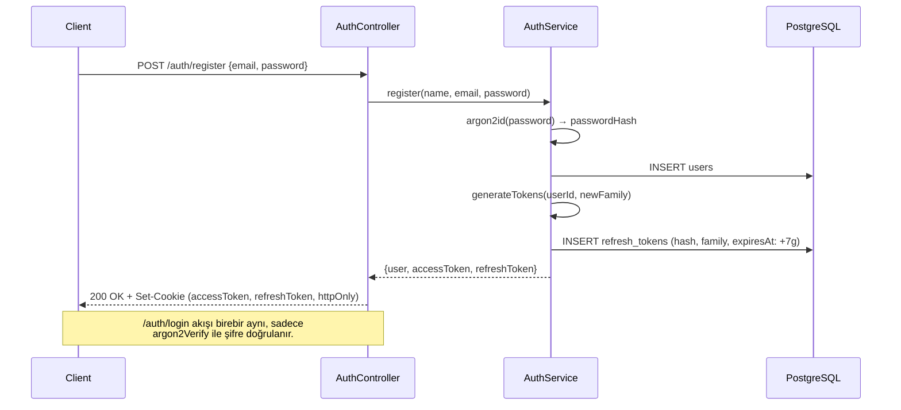
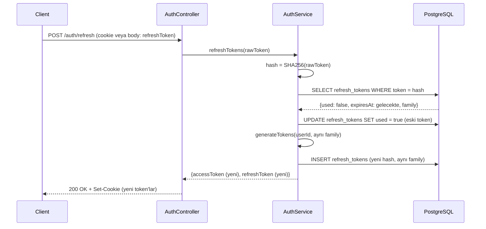
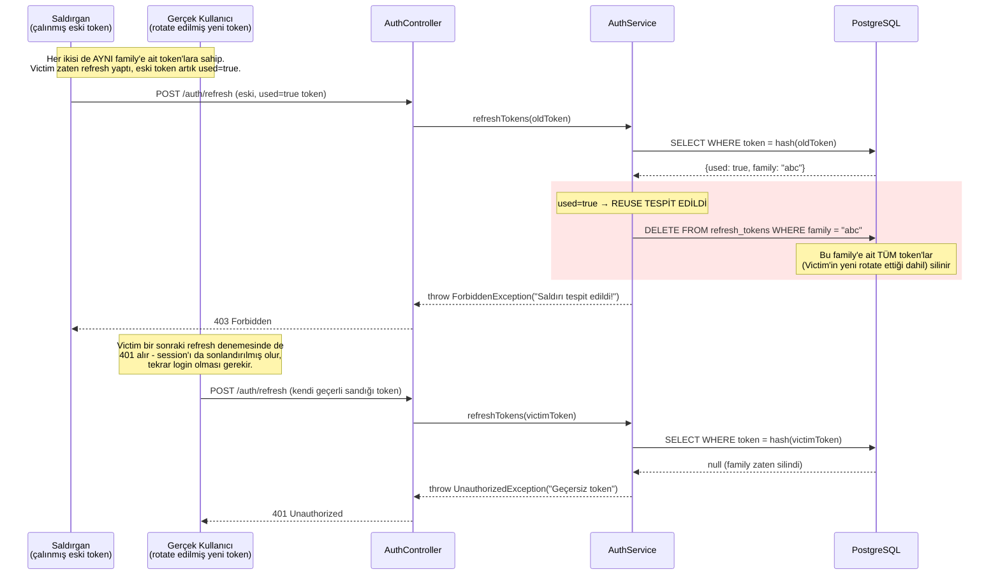

# Auth Akışı — JWT + Refresh Token Rotasyonu

**S2.1 kapsamı:** Access token (15 dk) + refresh token (7 gün, rotasyonlu, reuse tespitli) akışı.

## 1. Register / Login

## 2. Refresh Token Rotasyonu (Normal Akış)

## 3. Reuse (Yeniden Kullanım) Saldırı Tespiti

## Neden bu tasarım güvenli

- **Rotasyon:** Her refresh'te eski token `used=true` işaretlenir, yeni bir token üretilir. Bir token asla iki kez "normal" şekilde kullanılamaz.
- **Reuse tespiti:** `used=true` bir token tekrar geldiğinde, bu ya (a) bir race condition ya da (b) token'ın çalındığının işaretidir. Ayrım yapmadan güvenli tarafta kalıp **tüm family'i** iptal ediyoruz — meşru kullanıcı da etkilense bile (tekrar login olması gerekir), güvenlik önceliğimiz bu.
- **Family kavramı:** Aynı login oturumundan türeyen tüm refresh token'lar aynı `family` UUID'sini paylaşır. Bu, "bu token zinciri nereden başladı" bilgisini taşır ve reuse tespitinde toplu iptal için kullanılır.
- **Hash'li saklama:** DB'de asla ham refresh token tutulmaz, sadece SHA-256 hash'i. DB sızıntısı olsa bile token'lar doğrudan kullanılamaz.

## İlgili test

`test/auth-refresh-reuse.e2e-spec.ts` — reuse senaryosunu uçtan uca doğrular:
1. Login → refresh (rotate) → eski token'ı tekrar kullanmayı dene → 403 bekle
2. Rotate edilmiş yeni token'ı da dene → 401 bekle (family tamamen iptal olmuş olmalı)