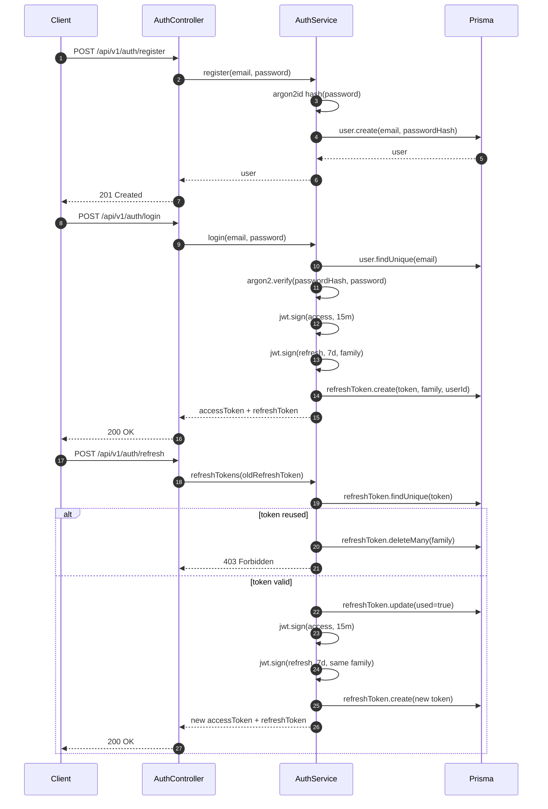

# Auth Token Flow

Bu akış `api/v1/auth/*` altında çalışır.

## Davranış

- Access token 15 dakikadır.
- Refresh token 7 gündür.
- Refresh token family mantığı ile döner.
- Kullanılmış refresh token tekrar gelirse aynı family’deki tüm tokenlar silinir.
- Parola kaydı argon2id ile hashlenir.

## Neden

- Kısa access token, çalınma etkisini azaltır.
- Uzun refresh token, kullanıcıyı sık sık tekrar girişe zorlamaz.
- Rotasyon, tek refresh token sızıntısında oturumu kademeli güvenli tutar.
- Reuse tespiti, çalınmış refresh token tekrar kullanıldığında saldırıyı görünür hale getirir.
